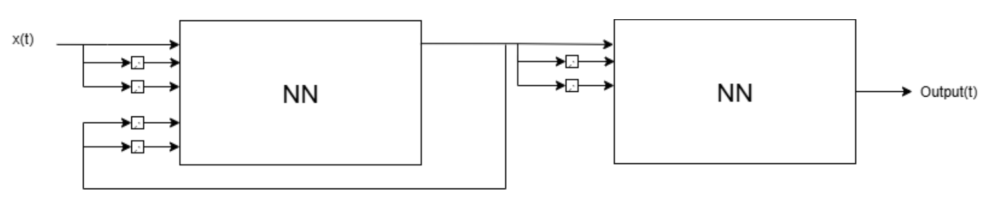

# SBP_2025

## Direct Inverse Control System - Project

## 📌 DESKRIPSI  
Repositori ini berisi implementasi dan materi pendukung **Sistem Berbaasis Pengetahuan**. Metode ini menggunakan **Neural Network (NN)** untuk mendekati model invers dari suatu sistem, sehingga dapat digunakan sebagai pengendali langsung. Implementasi dilakukan dalam **Python** dan **MATLAB** untuk keperluan analisis, simulasi, serta perbandingan hasil. 

## 🛠️ ARSITEKTUR

## 👩‍💻 KONTRIBUTOR
Puti Nabilah, E22  
Hanna Malika, E22

   

---
Error bukan musuh, melainkan pesan dari masa depan - 🤡, 2025
